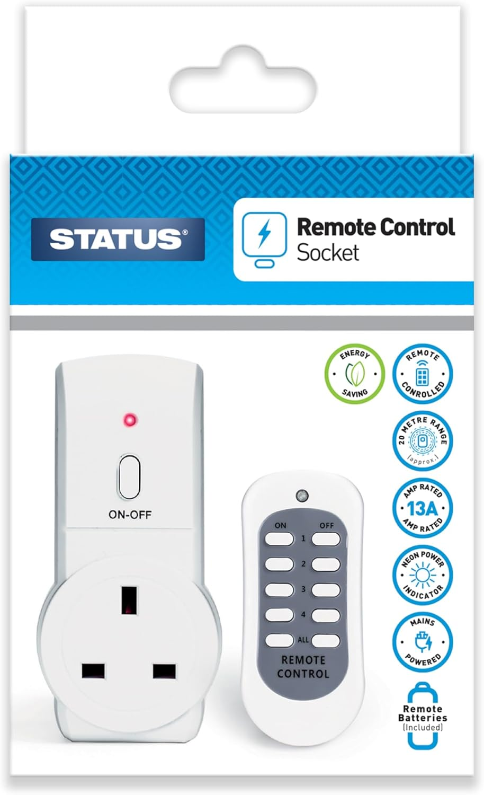
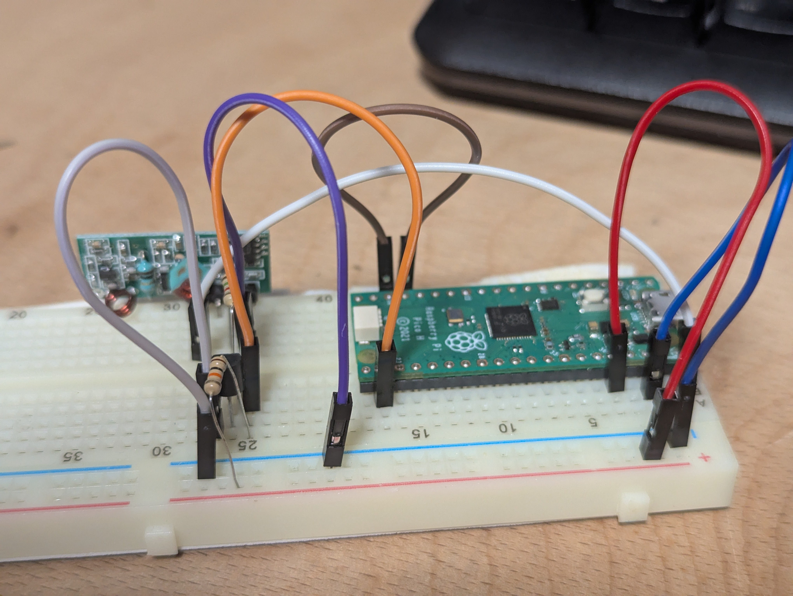
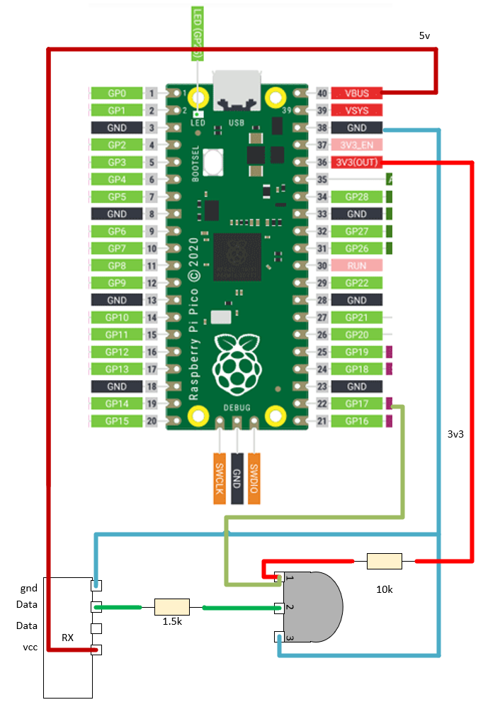
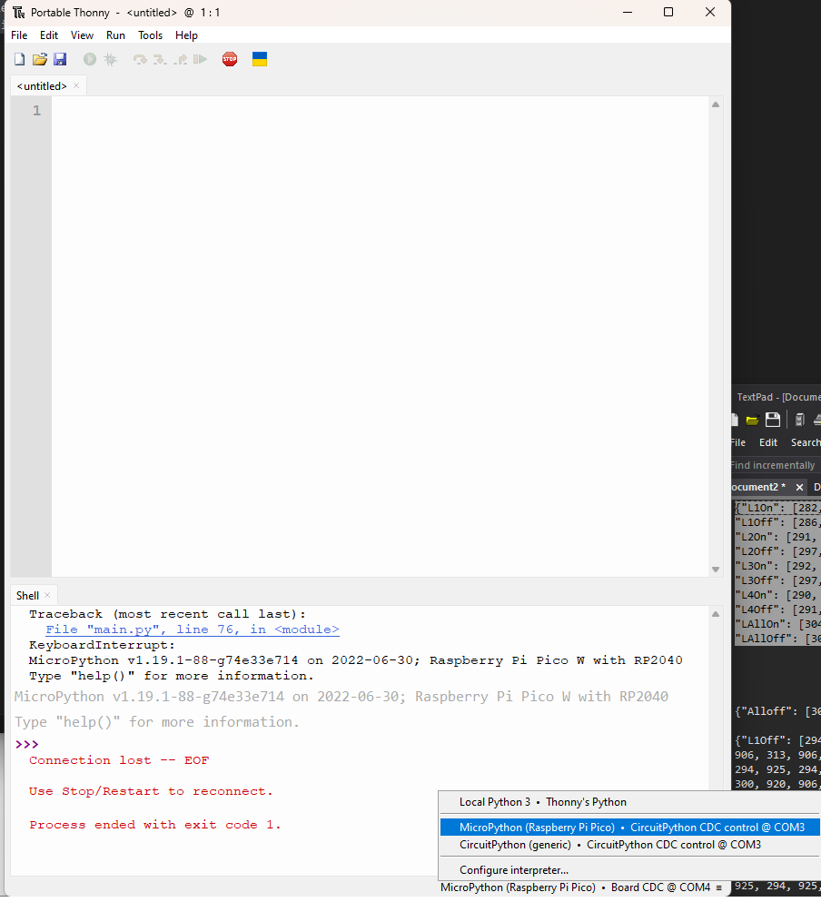

# 433Reader
Quick Project to decode a new 433mhz remote using a pi pico

## 10th March 2025

After almost a decade, the switches controlling our living room lamps are failing. The remote is also so warn the buttons are unreliable.



New sockets are cheap, but the trouble with new sockets is that a new remote has new codes - codes which I need to read and program into the light control system.


### Hardware

I'm using a pi pico and a cheap 433mhz RX unit. I have a whole bag full for some reason (not all of which work)



The resistors I'm using a 1.5k and 10k (pull-up)



The transitor is a PN2222A.

The RX board is powered with 5v and gnd.
The transitor is 'powered' with 3v3 (10k pull-up) and gnd.

The RX signal goes through a 1.5k current limit onto the base of the transitor.

When using the PN2222A transistor in this configuration, it will invert the signal from the RX data pin.

- Default State (5V): The transistor is on, pulling the collector to ground (0V), resulting in a low signal at the Pico's GPIO pin.

- Data State (0V): The transistor is off, and the pull-up resistor pulls the collector to 3.3V, resulting in a high signal at the Pico's GPIO pin.

This setup ensures that the 5V signal from the RX board is safely converted to 3.3V for the Pico and correctly inverted.
The receiver code is polarity agnostic so its fine to inverting the input signal.

### Software

The core of this project is the micropython library 
```
\micropython_remote-master
```

Specifically the folder \RX, which needs copying onto the Pi pico.

First I prepared the pico for micropython, using a built in feature of Thonny, which let me flash the firmware directly onto the connected board.



Now I only use Thonny for Micropython, so it may not be installed.

Thonny also doesn't support copying folder onto the pico so I installed Ampy with :
```
pip3 install adafruit-ampy
ampy --help
C:\Users\gibbens\Documents\Arduino\2022\pico433\micropython_remote-master>ampy --port COM4 ls

```

Ampy has a put command to copy the RX folder onto the pic.

```
C:\Users\gibbens\Documents\Arduino\2025\DieFiler\Software\micropython_remote-master>ampy --port COM6 put .\rx

C:\Users\gibbens\Documents\Arduino\2025\DieFiler\Software\micropython_remote-master>ampy --port COM6 put .\tx

C:\Users\gibbens\Documents\Arduino\2025\DieFiler\Software\micropython_remote-master>ampy --port COM6 ls
/main.py
/rx
/tx

```

The code itself is very simple:

```
from rx import RX
from rx.get_pin import pin
recv = RX(pin())

recv('on')

recv.save('remotes')
```

This uses GPI17 as the pin (defined in RX lib).
recv('on') will listen for **currently broadcasting** commands
the command will be written into the file 'remotes' as 'on'

You HAVE TO PRESS AND HOLD THE BUTTON ON THE REMOTE AS YOU RUN THE PROGRAM.

If you don't it will just terminate with an error.

If you are transmitting as you start the capture, it should capture some frames. E.g:
```
>>> recv('2on')
Awaiting radio data
Frame length = 50 No. of frames = 15
Averaging 15 frames
Capture quality   7.3 (perfect = 0)
Key "2on" stored.
```

I capture all the buttons on the new remote one at a time - recording to the file 'remotes' and copying the values out between runs of code.py

### Updating lamp control

The lamp control is also a pico with the TX library and some other bits.
I only needed to update the 'remotes' files contents.

The lamp controller can by plugged directly into USB and reached via Thonny - as above.